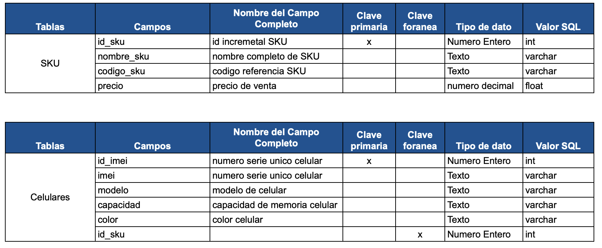

# Proyecto SQL creacion base de datos Celulares Apple

Este proyecto se realizará a razón de tener una base de datos capaz de guardar todos los datos de creación de nuevos productos en el catálogo de iphone.

### Objetivos:

- SKU de Celulares
- Consistencia en los datos
- Consultas rápidas y hacer conexiones con los diferentes excel de las áreas administrativas.

### Diagrama de Entidad Relacion:


### Tablas:




### Script SQL

Creacion de base de datos y tabla de celulares.

```
CREATE SCHEMA IF NOT EXISTS IphoneData;

USE IphoneData;

CREATE TABLE IF NOT exists Direccion (
	id_direccion int not null auto_increment,
    direccion varchar (255) not null,
    pais varchar (255) not null,
    ciudad varchar (255) not null,
    primary key (id_direccion)
);


CREATE TABLE IF NOT exists Clientes (
	id_cliente int not null auto_increment,
    dni varchar (8) not null,
    nombres varchar (255) not null,
    apellidos varchar (255) not null,
    id_direccion int,
    primary key (id_cliente),
    foreign key (id_direccion) references Direccion(id_direccion)
);

CREATE TABLE IF NOT exists Tienda (
	id_tienda int not null auto_increment,
    nombre_sucursal varchar (255) not null,
    id_direccion int,
    primary key (id_tienda),
    foreign key (id_direccion) references Direccion(id_direccion)
);


CREATE TABLE IF NOT exists sku (
	id_sku int not null auto_increment,
    nombre_sku varchar (255) not null,
	modelo varchar (255) not null,
	capacidad varchar (255) not null,
	color varchar (255) not null,
    codigo_sku varchar (255) not null,
    precio float,
    primary key (id_sku)
);

CREATE TABLE IF NOT exists Celulares(

	id_imei int not null auto_increment,
	imei varchar (15) not null,
    id_sku int,
    primary key (id_imei),
    foreign key (id_sku) references sku(id_sku)
);


CREATE TABLE IF NOT exists Ventas(

	id_venta int not null auto_increment,
	serie varchar (4) not null,
    numeracion varchar (3) not null,
    id_tienda int,
    id_cliente int,
    cantidad int,
    id_imei int,
    primary key (id_venta),
    foreign key (id_tienda) references Tienda(id_tienda),
    foreign key (id_cliente) references Clientes(id_cliente),
    foreign key (id_imei) references Celulares(id_imei)
);


```

### Script insert SQL

Creacion de insert sql

```

insert into Direccion(id_direccion,direccion,pais,ciudad)
VALUES
(1,"La direccion en Pueblo Libre","Peru","Pueblo Libre"),
(2,"La direccion en Miraflores","Peru","Miraflores"),
(3,"La direccion en Barranco","Peru","Barranco"),
(4,"La direccion en San Borja","Peru","San Borja"),
(5,"La direccion en Agustino","Peru","Aguatino"),
(6,"La direccion en Lima","Peru","Lima"),
(7,"La direccion en Surco","Peru","Surco"),
(8,"Av. San Martin 123","Peru","Miraflores"),
(9,"Calle Los Pinos 456","Peru","San Isidro"),
(10,"Jr. Huancayo 789","Peru","La Molina"),
(11,"Av. Arequipa 101","Peru","Barranco"),
(12,"Calle Tacna 202","Peru","Jesús María"),
(13,"Jr. Junin 303","Peru","San Borja"),
(14,"Av. Pardo 404","Peru","Jesús María"),
(15,"Calle Lima 505","Peru","Magdalena"),
(16,"Av. Larco 606","Peru","San Miguel"),
(17,"Jr. Cusco 707","Peru","Pueblo Libre"),
(18,"Calle Huaraz 808","Peru","San Miguel"),
(19,"Av. Ayacucho 909","Peru","Chorrillos"),
(20,"Jr. Callao 1010","Peru","Breña"),
(21,"Calle Iquitos 1111","Peru","La Victoria"),
(22,"Av. Huancavelica 1212","Peru","Jesús María"),
(23,"Jr. Ucayali 1313","Peru","Breña"),
(24,"Calle Piura 1414","Peru","Surquillo"),
(25,"Av. Lambayeque 1515","Peru","San Juan de Lurigancho"),
(26,"Jr. Tumbes 1616","Peru","Surquillo"),
(27,"Calle Amazonas 1717","Peru","San Miguel");


insert into Clientes(id_cliente, dni, nombres,apellidos,id_direccion)
values
(1,66453513,"Pedro","Linares",2),
(2,28910873,"Luis","De Carpio",3),
(3,83819755,"Miguel","Salas",1),
(4,97308736,"Brigitte","Colsa",4),
(5,15490415,"Katia","Perez",5),
(6,62083640,"Valentina","Martínez",8),
(7,63434897,"Mateo","García",9),
(8,22468945,"Isabella","Rodríguez",10),
(9,94287825,"Santiago","López",11),
(10,23789714,"Amelia","Pérez",12),
(11,71683594,"Diego","González",13),
(12,82100391,"Olivia","Ramírez",14),
(13,21647160,"Gabriel","Torres",15),
(14,59232724,"Sofia","Sánchez",16),
(15,15844386,"Alejandro","Castro",17),
(16,15441273,"Camila","Flores",18),
(17,16568585,"Leonardo","Díaz",19),
(18,66909706,"Valeria","Herrera",20),
(19,56739624,"Daniel","Ruiz",21),
(20,80119473,"Natalia","Ortega",22),
(21,74008708,"Lucas","Jiménez",23),
(22,21334829,"Emma","Vargas",24),
(23,20920037,"Adrian","Reyes",25),
(24,76053132,"Mia","Mendoza",26),
(25,88453745,"Andres","Medina",27);


insert into Tienda(id_tienda,nombre_sucursal,id_direccion)
values
(1,"Tienda Lima",6),
(2,"Tienda Surco",7);


insert into sku(id_sku, nombre_sku,modelo,capacidad,color, codigo_sku,precio)
values

(1,"iPhone Xr 128 Rojo","iPhone Xr",128,"Rojo","XR128ROJ",999),
(2,"iPhone SE 2020 64 Negro","iPhone SE 2020",64,"Negro","SE264NEG",499),
(3,"iPhone Xs 256 Dorado","iPhone Xs",256,"Dorado","XS256DOR",1300),
(4,"iPhone 11 128 Blanco","iPhone 11",128,"Blanco","11128BLA",1800),
(5,"iPhone 11 128 Morado","iPhone 11",128,"Morado","11128MOR",1800);


insert into Celulares(id_imei,imei,id_sku)
values
(1,"899785403717701",2),
(2,"965979360196480",5),
(3,"905133997837684",3),
(4,"562607816352275",1),
(5,"303047736791084",2),
(6,"820363848987001",2),
(7,"338268132978297",2),
(8,"175672153979542",2),
(9,"502908668981736",2),
(10,"271899756817026",4),
(11,"124979657739823",2),
(12,"356560032035739",3),
(13,"291978043337667",3),
(14,"587433572073705",3),
(15,"558115464012495",5),
(16,"286317154258125",4),
(17,"398261857399933",5),
(18,"172722826645041",2),
(19,"588713986918517",4),
(20,"920165107918006",1),
(21,"194147488182941",5),
(22,"376471582028381",5),
(23,"636752107270364",1),
(24,"436208529041474",1),
(25,"160869555071337",1);


insert into Ventas(id_venta,serie,numeracion,id_tienda,id_cliente,cantidad,id_imei)
values
(1,"B001","001",2,1,1,1),
(2,"B001","002",1,2,1,2),
(3,"B001","003",2,3,1,3),
(4,"B001","004",2,4,1,4),
(5,"B001","005",1,5,1,5),
(6,"B001","006",1,6,1,6),
(7,"B001","007",2,7,1,7),
(8,"B001","008",1,8,1,8),
(9,"B001","009",1,9,1,9),
(10,"B001","010",1,10,1,10),
(11,"B001","011",2,11,1,11),
(12,"B001","012",1,12,1,12),
(13,"B001","013",1,13,1,13),
(14,"B001","014",2,14,1,14),
(15,"B001","015",2,15,1,15),
(16,"B001","016",2,16,1,16),
(17,"B001","017",1,17,1,17),
(18,"B001","018",1,18,1,18),
(19,"B001","019",1,19,1,19),
(20,"B001","020",2,20,1,20),
(21,"B001","021",1,21,1,21),
(22,"B001","022",2,22,1,22),
(23,"B001","023",2,23,1,23),
(24,"B001","024",1,24,1,24),
(25,"B001","025",2,25,1,25);

```

### Create View SQL

Creacion de Vistas en SQL

```

create view  detalle_celulares_imei as
select
	c.id_imei,
    c.imei,
    s.codigo_sku,
    s.modelo,
    s.capacidad,
    s.color,
    s.precio
from celulares c
join sku s
	on c.id_sku = s.id_sku;


create view venta_total_sucursal as
select
	t.nombre_sucursal,
    sum(v.cantidad *d.precio) as total
from Ventas v
join detalle_celulares_imei d
	on v.id_imei = d.id_imei
join Tienda t
	on v.id_tienda = t.id_tienda
group by t.nombre_sucursal;


create view cantidad_venta_distrito as
select
	d.ciudad,
    sum(v.cantidad) as cantidadTotal
from Ventas v
join Clientes c
	on v.id_cliente = c.id_cliente
join Direccion d
	on c.id_direccion = d.id_direccion
group by d.ciudad
order by cantidadTotal DESC;


create view detalle_ventas as
select
	v.serie,
    v.numeracion,
    t.nombre_sucursal,
    c.dni,
    c.nombres,
    c.apellidos,
    d.direccion,
    d.ciudad,
	dc.imei,
    dc.codigo_sku,
    dc.modelo,
    v.cantidad,
    dc.precio,
    (v.cantidad * dc.precio) as monto
from Ventas v
join Tienda t
	on v.id_tienda = t.id_tienda
join Clientes c
	on v.id_cliente = c.id_cliente
join Direccion d
	on c.id_direccion = d.id_direccion
join detalle_celulares_imei dc
	on v.id_imei = dc.id_imei;


create view ventas_por_ciudad as
select
	ciudad,
    sum(monto) as total
 from detalle_ventas
 group by ciudad
 order by total desc;
```

### Function Storage

Creacion de function storage

```
delimiter %
create function PagoIgv(monto int) returns float
deterministic
begin
	return monto * 0.18;
end%

create function Total(monto int) returns float
deterministic
begin
	return monto * 1.18;
end%

SELECT *, PagoIgv(monto) as igv, Total(monto) as Total  FROM IphoneData.detalle_ventas;
```

### Function Storage procedure

Creacion de storage procedure

```
delimiter //
create procedure sp_get_documentos()
begin
	/* store procede para ver detalle de documentos */
	select serie,numeracion from IphoneData.detalle_ventas
    order by numeracion asc;

end//

call sp_get_documentos

create procedure sp_get_ciudad_top(in top int)
begin
	/* store procede para ver consolidado de todas las ventas por ciudad de top, ingresar cero para tener todos los distritos */

    if top = 0 then
		select ciudad,sum(monto) from IphoneData.detalle_ventas
		group by ciudad
		order by sum(monto) desc;
	else
		select ciudad,sum(monto) from IphoneData.detalle_ventas
		group by ciudad
		order by sum(monto) desc
		limit top;
    end if;

end//

call sp_get_ciudad_top(5)

```

### Triggers

Creacion de triggers

```

create table control_series (
	id int primary key auto_increment,
    serie varchar(4),
    numeracion varchar(10),
    id_cliente varchar(8),
    estado varchar(10) not null default 'emitido',
    dia datetime
);


create trigger before_control_series
before insert on Ventas
for each row
insert control_series (id, serie, numeracion, id_cliente, dia) values(new.id_venta, new.serie, new.numeracion, new.id_cliente, now());

DELIMITER //
create trigger afert_delete_series
after delete on ventas
for each row
begin
	update control_series
    set estado = 'anulado', dia = now()
    where id = OLD.id_venta;
end;
//
DELIMITER ;


-- test

insert into Ventas(id_venta,serie,numeracion,id_tienda,id_cliente,cantidad,id_imei)
values
(29,"B001","029",2,25,3,20);


delete from Ventas
where id_venta = 29;


-- drop trigger before_control_series

```
